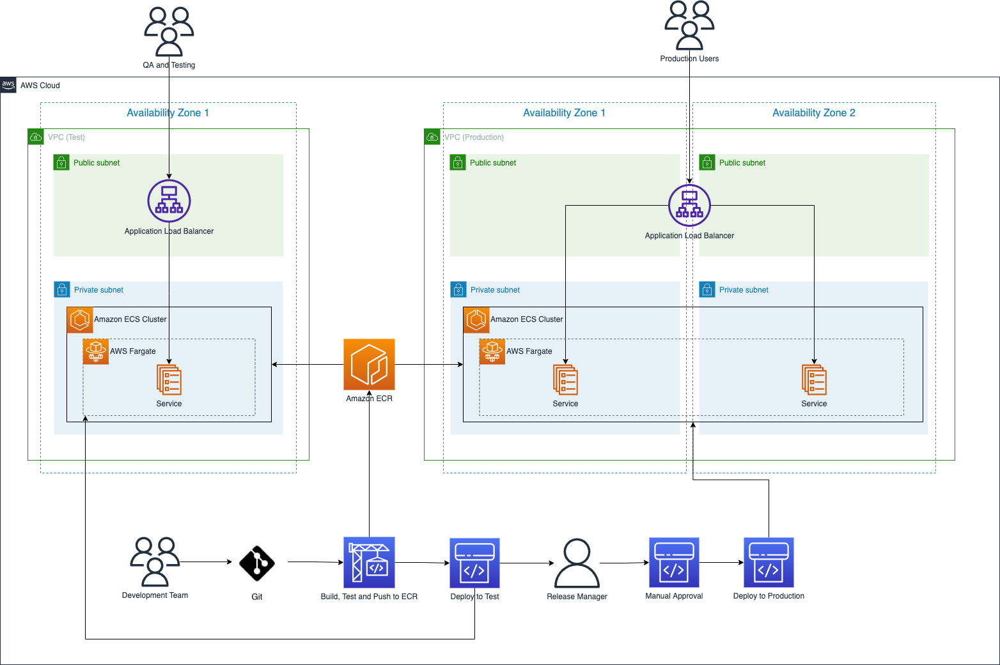
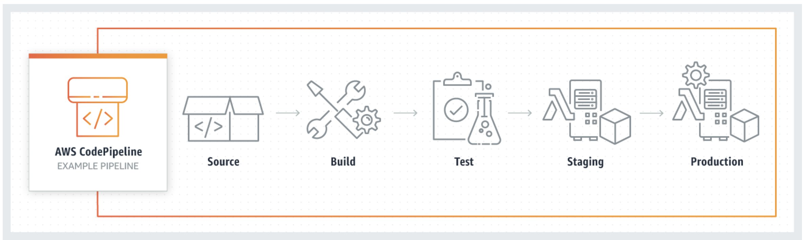
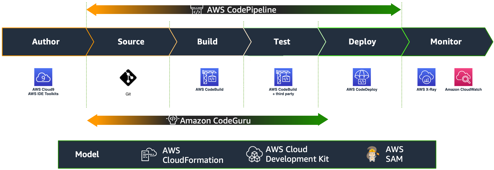

[Source](https://catalog.workshops.aws/cicdonaws/en-US)

# CI/CD on AWS Workshop

Welcome to the CI/CD on AWS Workshop!

This workshop is aimed at providing a hands-on experience for software engineers, platform engineers and architects to get started with Continuous Integration and Continuous Delivery (CI/CD) tools on AWS.

## What to expect from this workshop

### What will I learn?

You will learn about creating an end-to-end CI/CD pipeline and deploying using DevOps best practices such as Infrastructure as Code (IaC) on AWS. This will cover the fundamental concepts of Continuous Integration, Continuous Deployment, and Continuous Delivery. You will deploy a containerized application using the AWS Cloud Development Kit (CDK) and perform automated testing, integration, and deployments.

By the end of this workshop, you'll be able to:

- Create new CDK applications.
- Create infrastructure as code.
- Deploy your CDK applications to AWS.
- Build CI/CD pipelines to automatically build, test and deploy your application.

### How much time does it take to complete the workshop?

You will need around 3 hours to complete all modules of this workshop. The modules are independent of each other so you can pick and choose and learn as you wish.

### What is the required learning level?

Level 200 and up. Although you don't need to be an expert to take this workshop, it will help if you have a basic understanding of application development, source control, CI/CD and Infrastructure as Code.

### Will it cost me anything?

If you are in an AWS hosted event, there will be no charges for the workshop.

Going through this workshop in your own account may incur some costs. Make sure to follow the Clean Up Resources section to remove workshop-related resources at the end to avoid unnecessary charges.

### Supported regions

This workshop uses AWS CodeBuild with Lambda compute. It is supported in the following regions:

- US East (N. Virginia) — us-east-1
- US East (Ohio) — us-east-2
- US West (Oregon) — us-west-2
- Asia Pacific (Mumbai) — ap-south-1
- Asia Pacific (Singapore) — ap-southeast-1
- Asia Pacific (Sydney) — ap-southeast-2
- Asia Pacific (Tokyo) — ap-northeast-1
- Europe (Frankfurt) — eu-central-1
- Europe (Ireland) — eu-west-1
- South America (São Paulo) — sa-east-1

## Target architecture

In this workshop you will be using DevOps best practices to automate change management, building, testing and deploying an application on AWS. Your target architecture will look like this:

You will be using practices such as:

- Developing web applications using Docker containers.
- Setting up a source control service to manage source code changes.
- Continuous Integration to automate building and testing.
- Continuous Deployment to automatically deploy to your test environment.
- Continuous Delivery to approve deployments to your production environment.
- Infrastructure as Code to define all the steps you take in code.

## CI/CD pipeline overview

Continuous Integration/Continuous Delivery (CI/CD) can be pictured as a pipeline, where new code is submitted on one end, tested over a series of stages (source, build, test, staging, and production), and then published as production-ready code.

Each stage of the CI/CD pipeline is structured as a logical unit in the delivery process. Each stage acts as a gate that vets a certain aspect of the code. As the code progresses through the pipeline, the assumption is that the quality of the code is higher in the later stages, because more aspects of it continue to be verified. Problems uncovered in an early stage stop the code from progressing through the pipeline. Results from the tests are immediately sent to the team, and all further builds and releases are stopped if software does not pass the stage.

## AWS CI/CD pipeline components

AWS brings in a complete set of CI/CD developer tools to accelerate software development and release cycles. AWS CodePipeline automates the build, test, and deploy phases of the release process every time there is a code change, based on the defined release model. This enables the rapid and reliable delivery of features and updates.

You will be writing your application and infrastructure code in either TypeScript or Python using the following services and tools:

- [AWS Cloud Development Kit](https://aws.amazon.com/cdk/)
- [AWS CodeCommit](https://docs.aws.amazon.com/codecommit/latest/userguide/welcome.html)
- [AWS CodeConnections](https://docs.aws.amazon.com/dtconsole/latest/userguide/welcome-connections.html)
- [AWS CodeBuild](https://aws.amazon.com/codebuild/)
- [AWS CodePipeline](https://aws.amazon.com/codepipeline/)
- [AWS CodeDeploy](https://aws.amazon.com/codedeploy/)
- [Docker](https://aws.amazon.com/docker/)
- [Amazon Elastic Container Registry](https://aws.amazon.com/ecr/)
- [Amazon Elastic Container Service](https://aws.amazon.com/ecs/)

The creation of CI/CD pipelines using these services can be automated using AWS CDK and AWS CloudFormation.
