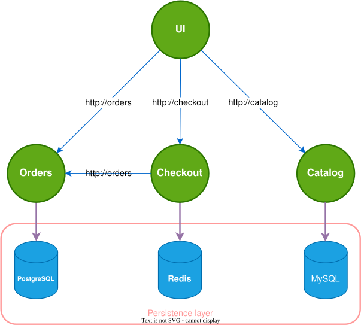
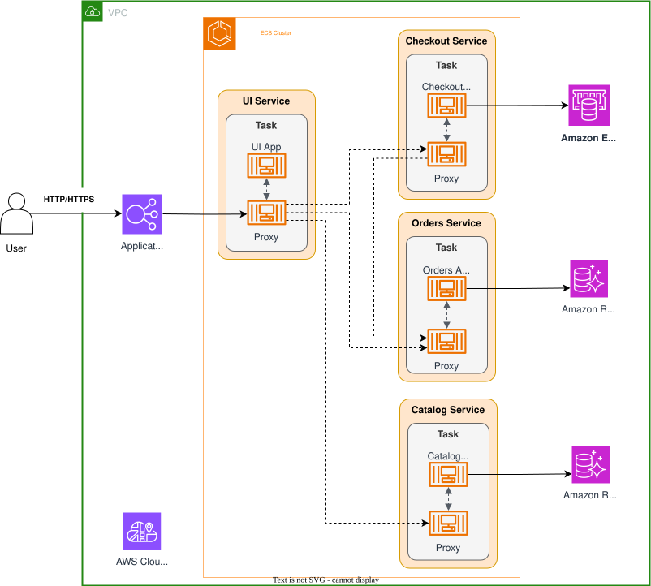

# 📘 Deploy the Multi-Tier Application

## Important

[Source](https://catalog.us-east-1.prod.workshops.aws/workshops/7eaa1783-1592-4bdc-b579-630e53f00afa/en-US/40-lp-events/40-networking)

You must have completed the following chapters as pre-requisites for this lab: [Deploy an MVP on Amazon ECS](https://catalog.us-east-1.prod.workshops.aws/workshops/7eaa1783-1592-4bdc-b579-630e53f00afa/en-US/40-lp-events/30-basic/)

Great news! AnyCompany Stores MVP launch was successful, and the business is expanding rapidly. The development team has grown from 3 to 15 engineers, organized into specialized squads: Frontend, Orders, and Checkout teams. Each squad wants to develop and deploy their components independently.

The monolithic application is becoming difficult to manage with multiple teams. It's time to decompose it into microservices - separate services for UI, Orders, and Checkout components that can communicate with each other efficiently.

Your challenge is to enable seamless communication between these services while maintaining the simplicity and reliability that made the MVP successful.

## Amazon ECS Service Connect

ECS Service Connect is the recommended approach for handling service-to-service communication, offering features such as service discovery, connectivity, and traffic monitoring. With Service Connect, your applications can utilize short names and standard ports to connect to ECS services within the same cluster, across different clusters, across VPCs and event across AWS Accounts within the same AWS Region. [For more detailed information, refer to the AWS documentation.](https://docs.aws.amazon.com/AmazonECS/latest/developerguide/networking-connecting-services.html#networking-connecting-services-serviceconnect) 

Alternative options for configuring inter-service communication within Amazon ECS Services include:

[Internal Load Balancer](https://docs.aws.amazon.com/AmazonECS/latest/developerguide/networking-connecting-services.html#networking-connecting-services-elb) 

[Service Discovery](https://docs.aws.amazon.com/AmazonECS/latest/developerguide/networking-connecting-services.html#networking-connecting-services-direct) 

[Amazon VPC Lattice](https://docs.aws.amazon.com/AmazonECS/latest/developerguide/ecs-vpc-lattice.html)

## Deploy the Micro-Services with Service Connect

In this section, we'll enable ECS Service Connect in our cluster by deploying three additional microservices that the UI service will communicate with:

