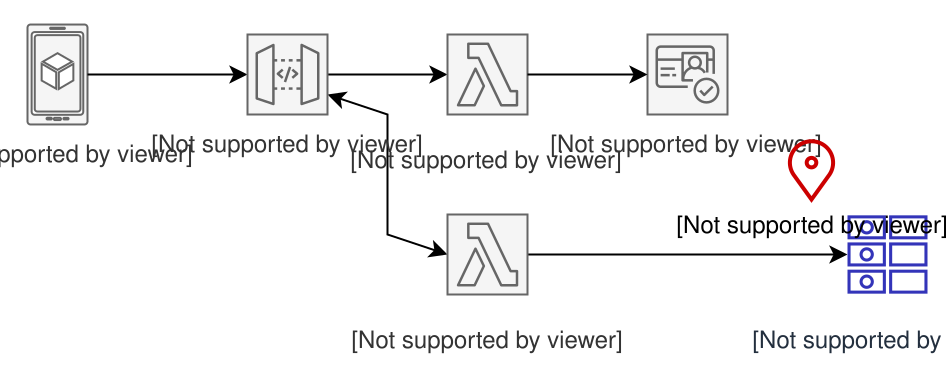
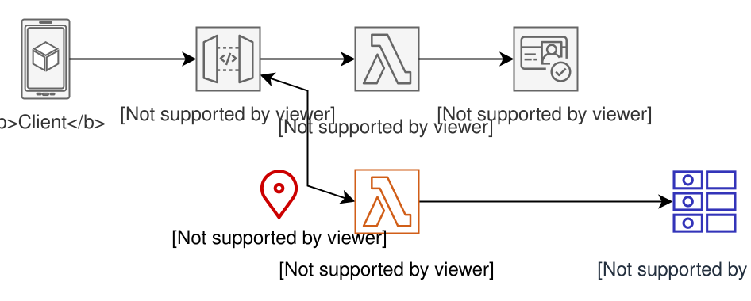

[Source](https://catalog.us-east-1.prod.workshops.aws/workshops/76bc5278-3f38-46e8-b306-f0bfda551f5a/en-US/module2/sam-python/datastore)

# 1 - Create data store

Your application needs a place to store user data. For that, you'll create a Users table in DynamoDB.

You will use an AWS SAM template with the AWS SAM CLI to create the table resource.

First, you add resource descriptions to the AWS SAM template.yaml file. Then, you use the sam command line utility to transform the template.yaml invisibly into a CloudFormation template that is sent to AWS CloudFormation to create a stack.

stack - a collection of infrastructure services, resources, connections, security, and code that you can manage as a single unit. A stack is either created or deleted completely, or all proposed changes are rolled back.

# 2 - Add Business Logic

You will create one Lambda function to handle all requests for the /users/* resource. The function will check the route in the request and act accordingly. The function code will reside in a file called users.py in the src/api directory.

We have you start with a multi-purpose function because it is common when migrating existing applications to serverless. A multi-purpose function handles several HTTP methods. These are also called monolithic functions. In contrast, a single-purpose function handles only one HTTP method.

In a later module, we will explain a refactoring process to transition from one monolithic function to several single-purpose functions using the Strangler Fig pattern. In green field applications, we recommend single-purpose functions so you can distribute responsibility across your team and apply granular security policies.

This function will need to access data in the DynamoDB table created in the previous step. The table name will be exported to an environment variable (USERS_TABLE) so the dynamically prefixed table name can be used by a function to get user data.

You will also grant the function permission to access data in the table with DynamoDBCrudPolicy, which is an [AWS SAM policy template.](https://docs.aws.amazon.com/serverless-application-model/latest/developerguide/serverless-policy-templates.html)
